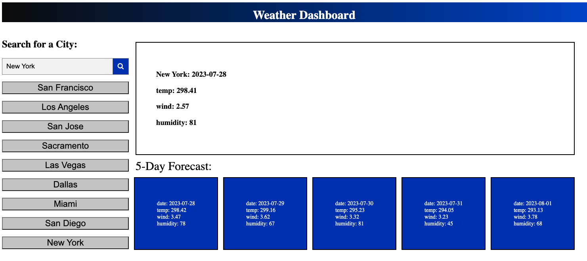

# Weather-prediction

## Description

The weather forecast is a prediction of the atmospheric conditions expected in a specific area over a given period of time. This forecast is usually provided by meteorologists who study various weather patterns and use sophisticated instruments and computer models to make their predictions. The forecast may include information about temperature, wind speed, humidity, and other weather variables. The weather prediction page, gives to users an estimate of the weather for the next 5 days. 

## Installation
N/A

## Usage

Enter a city in the search bar to find out the weather forecast for the next 5 days. Containers with temp, wind and humidity for each of the next 5 days.

## Credits
N/A

## Deployed Site

[Live Demo Link](https://fabioesilveira.github.io/Weather-prediction/)
