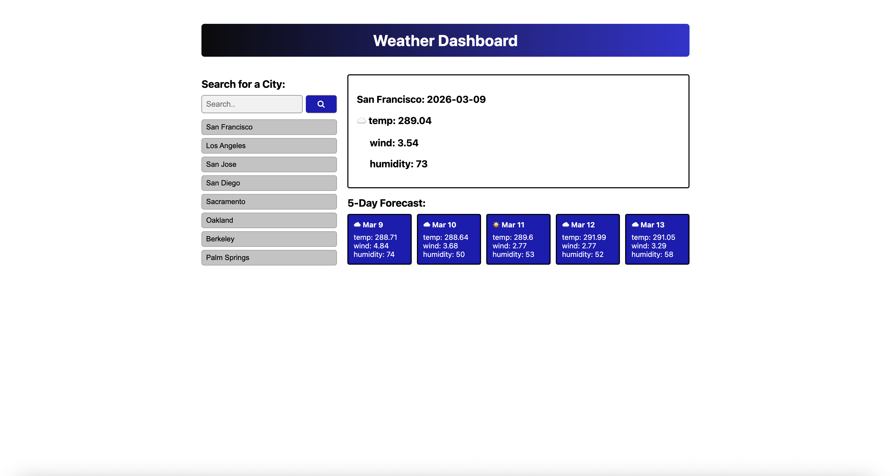

# Weather Dashboard

A fast and simple Weather Dashboard that displays **current weather conditions**, **5-day forecast**, and automatically saves **search history** using `localStorage`.  
Built with **HTML, CSS, JavaScript**, and the **OpenWeather API**.

---

## Features

### Search for Any City
- Type a city name and instantly fetch:
  - Temperature  
  - Wind speed  
  - Humidity  
  - Weather condition emoji  

### 5-Day Weather Forecast
- Uses the OpenWeather 3-hour interval forecast  
- Displays:
  - Date  
  - Temperature  
  - Wind  
  - Humidity  
  - Weather Emoji (☀️🌧️⛈️❄️🌫️)

### Search History (Persistent)
- Each search is saved and displayed as a button  
- Clicking a button instantly loads that city’s weather  
- Data is stored in `localStorage` and persists after refresh

=======
### 🎨 Clean & Organized Layout
- Left column: search bar + search history buttons
- Right column: current weather details + 5-day forecast cards
- Responsive layout for desktop and mobile screens 

---

## Technologies Used

- **HTML5**
- **CSS3**
- **JavaScript (ES6+)**
- **OpenWeather API**
- **LocalStorage**
- **Font Awesome**

---

## Deployed Site

[Live Demo Link](https://fabioesilveira.github.io/Weather-Prediction/)
